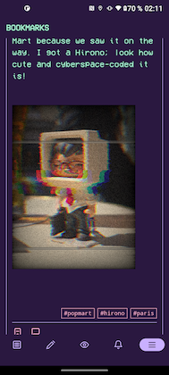
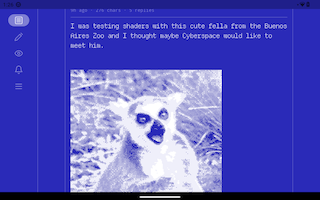
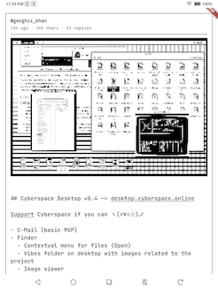

# Ono-Sendai

Ono-Sendai is a Flutter client for [cyberspace.online](https://cyberspace.online) that runs on mobile and desktop. API implementation lives in [`cyberspace_client`](https://github.com/isometricduck/cyberspace_client).

Suggested installation method is through Obtainium, which will let you know when a new version is released. To install, select "Add app" in Obtainium and use the source URL: https://github.com/isometricduck/onosendai . You can also simply download and install the .apk file from the releases section.

## Features:
- Browse your feed
- Write posts, replies and journal entries
- Bookmark posts and see your bookmarks
- See your in-app notifications
- Use the classic themes from the cyberspace web or new ones with animated shaders
- E-Reader version: high contrast, no animations, ebook-like navigation

## Notes:
- Your password is never stored on the device.
- The app does not have telemetry of any kind, so if it crashes I won't know unless you want to be helpful and drop me a C-Mail.
- This is not a vibe-coded app, but AI is used in its development.
- There are currently no plans to release this in Play Store / App Store.
- Feel free to contact me through C-Mail with bug reports, requests, comments, etc.

## Screenshots

